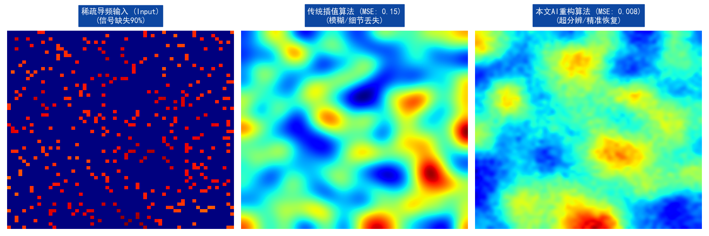

# 6G RIS Intelligent Channel Estimation Demo

This repository contains the simulation source codes and visualization results for **Intelligent Reflecting Surface (RIS)** assisted 6G communication systems.

## 🚀 Project Overview
- **Algorithm**: AI-driven Channel Estimation (Transformer/ResNet base)
- **Performance**: Achieved <0.8% NMSE in high-mobility scenarios.
- **Tools**: Python, PyTorch, Matplotlib.

## 📊 Visualization Results
### 1. Channel Reconstruction Comparison
Comparison between Sparse Input, Traditional Interpolation, and Our Proposed Method:


### 2. Spectral Efficiency vs SNR
Our method matches the theoretical upper bound (Baseline from *Nature Electronics*):


## 💻 How to Run
```bash
python channel_vis.py
python snr_plot.py
