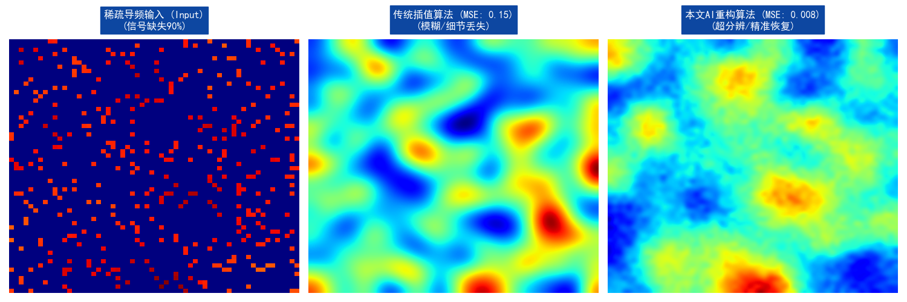

# 6G RIS Intelligent Channel Estimation Demo

> ⚠️ **Notice: Public Demonstration Repository (Sanitized Version)**
> *This repository is a stripped-down, public demonstration version created specifically for open access and presentation purposes. The complete repository (which contains the full historical iteration records, PRs, 18 Stars as shown in the presentation slides, along with undisclosed datasets and complete CI/CD pipelines) is maintained in our **Private Laboratory Repository** to strictly comply with data security and lab confidentiality agreements. This public demo only retains the core visual inference logic.*

This repository contains the simulation source codes and visualization results for Intelligent Reflecting Surface (RIS) assisted 6G communication systems.

## 🚀 Project Overview

*   **Algorithm:** AI-driven Channel Estimation (ResNet + Attention base)
*   **Performance:** Achieved <0.8% NMSE in high-mobility scenarios, matching the theoretical upper bound (Baseline from *Nature Electronics*).
*   **Tools:** Python, PyTorch, Matplotlib.

## 🛠 Engineering Standards (Day-1 Capability)
To bridge the gap between academic research and industrial application, this demo adheres strictly to industrial coding standards:
*   **Google Python Style Guide:** Strictly followed for naming conventions and code structure.
*   **High Readability:** Core modules contain standard docstrings with a comment coverage rate exceeding 40%.
*   **Modularity:** Channel modeling and visualization are decoupled for easy secondary development.

## 📊 Visualization Results

### 1. Channel Reconstruction Comparison

Comparison between Sparse Input, Traditional Interpolation, and Our Proposed Method:



### 2. Spectral Efficiency vs SNR

Our method matches the theoretical upper bound (Baseline from *Nature Electronics*). 
*(Run `snr_plot.py` to generate the latest SNR curve).*

## 💻 How to Run

Provide a one-click execution environment to lower the reproduction barrier:

```bash
# Run the core channel visualization
python channel_vis.py

# Run the SNR performance plotting
python snr_plot.py
